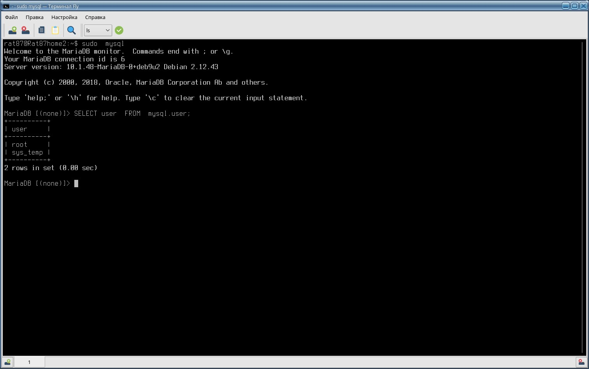
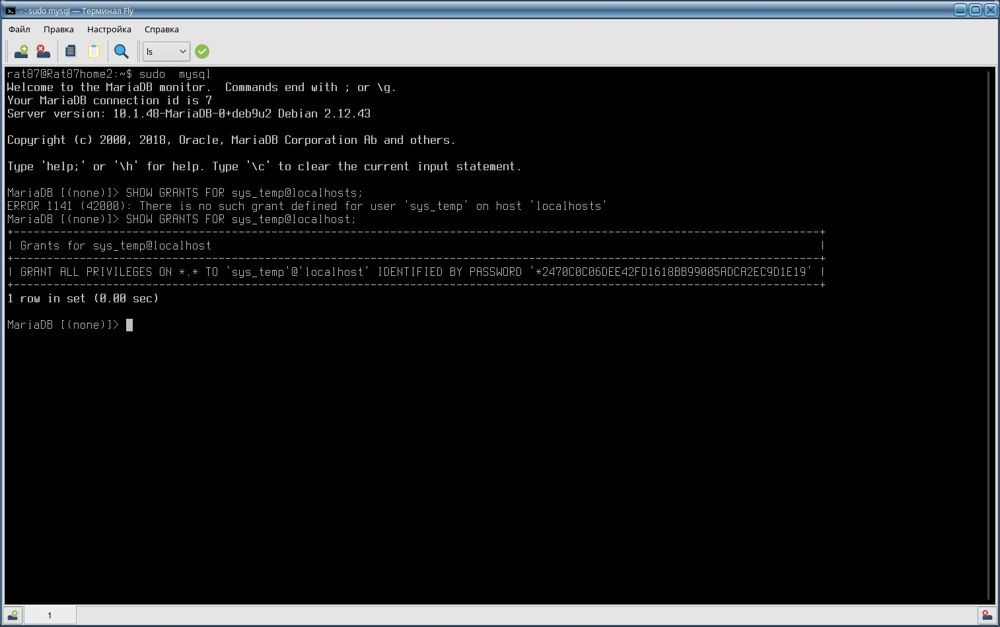
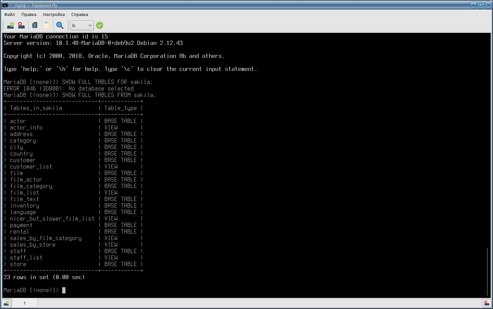
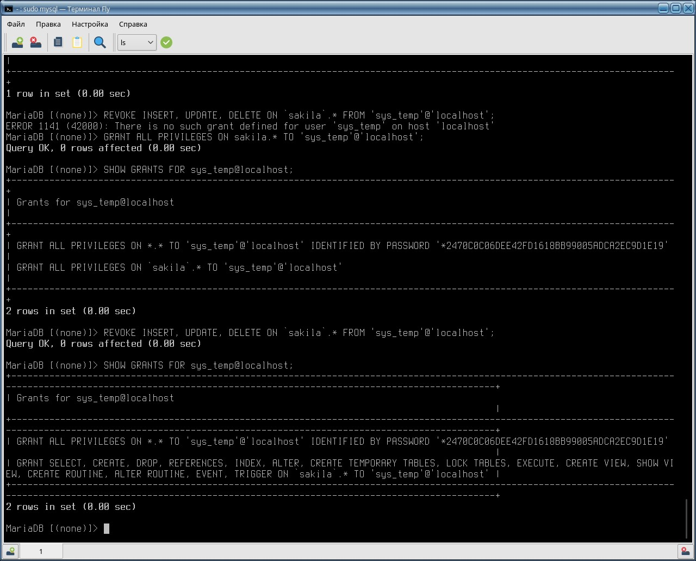

# Домашнее задание к занятию "`Работа с данными (DDL/DML)" - `Дьяконов Алексей`

### Задание 1. MySQL 

2.`Создайте учётную запись sys_temp.`
```
     CREATE USER `sys_temp`@`localhost` IDENIFIED BY 'password';
```
3. `Выполните запрос на получение списка пользователей в базе данных. (скриншот)
(Пользователи в MySQL хранятся в базе данных под названием mysql в таблице user.)`
```
     SELECT user FROM mysql.user;
```
-

4. `Дайте все права для пользователя sys_temp.`
```
     GRANT ALL PRIVILEGES ON *.* TO 'sys_temp'@'localhost';
```

5. ` Выполните запрос на получение списка прав для пользователя sys_temp. (скриншот)`
```
SHOW GRANTS FOR sys_temp@localhost;
```
-

6. `Переподключитесь к базе данных от имени sys_temp.`
```
     mysql --user=sys_temp --password=password
```
`Посмотреть текущего пользователя`
```
     SELECT user();
```

7. `Восстановите дамп в базу данных.`
```
     SOURCE /home/rat87/Загрузки/sakila-db/sakila-schema.sql;
     SOURCE /home/rat87/Загрузки/sakila-db/sakila-data.sql;
```
8. `Список таблиц`

` В командной строке (если не указать во втором запросе FULL будет не понятно, 
что является таблицей, а что - представлением! ):`
```
     SHOW DATABASES;
     SHOW FULL TABLES FROM sakila;
```
-

  ### Задание 2.  Таблица сопоставления названий таблиц  и первичных ключей.  \

  [Ответ](./files/hw-12-02.xlsx)

  ### Задание 3.

  `Несмотря на наличие всех привилений для пользователя sys_temp пришлось сначала выдать ему
  все права на базу sakila, а потом убрать нужные:`

```
     GRANT ALL PRIVILEGES ON sakila.* TO 'sys_temp'@'localhost';
     REVOKE INSERT, UPDATE, DELETE ON `sakila`.* FROM 'sys_temp'@'localhost';
```
-
     
